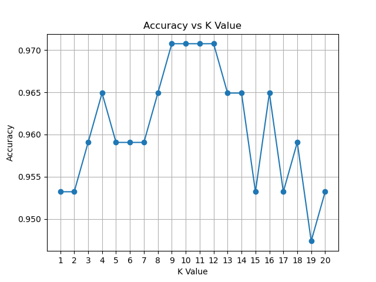

# Breast Cancer Classification with KNN

This is a simple machine learning project where I use the K-Nearest Neighbors (KNN) algorithm to classify tumors as malignant or benign. The dataset comes from `sklearn.datasets.load_breast_cancer`, which includes 30 numeric features for 569 samples.

## Dataset Info

- 569 samples
- 30 numerical features
- Target: 0 (malignant), 1 (benign)

## What’s in the project

- Data loading and preparation
- Train-test split and standardization
- Training a KNN model (starting with k=3)
- Evaluating accuracy and confusion matrix
- Trying different k values (1 to 20) and plotting the results

## Accuracy Plot

Below is the plot showing how accuracy changes with different k values:

